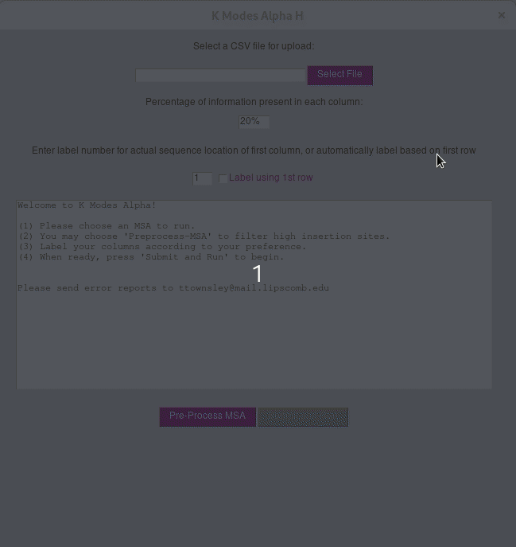

# kmodes
Instructions for setup:

Requires python 3.7+
- git clone ```https://github.com/mandosoft/kmodes.git```  
- Setup virtual environment
- Set working directory to ```<user-path>/kmodes```
- Install libraries:
```bash
pip3 install -r requirements.txt
```
- Run using python main.py

<p align="center">

</p>
